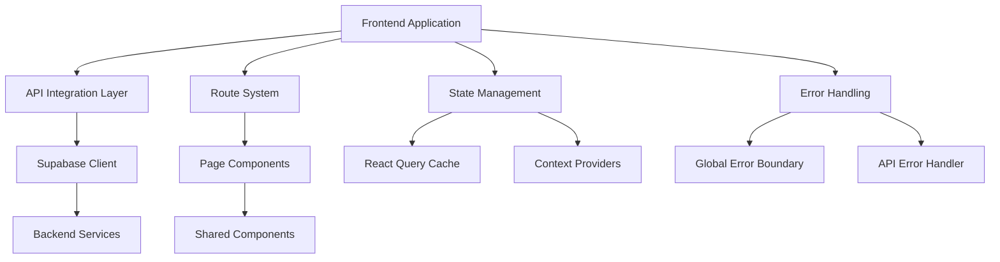

# Design Document

## Overview

This design outlines a comprehensive frontend refactoring approach to align the React TypeScript application with backend APIs, eliminate console errors, fix routing issues, and ensure production readiness. The design focuses on systematic code review, error elimination, and architectural improvements while maintaining existing functionality.

## Architecture

### Current Architecture Analysis

The application follows a modern React architecture with:
- **Frontend**: React 18 + TypeScript + Vite
- **Backend**: Supabase (PostgreSQL + Auth + Real-time)
- **State Management**: React Query + Context API
- **Routing**: React Router v6
- **UI Framework**: Radix UI + Tailwind CSS
- **Build System**: Vite with SWC

### Target Architecture Improvements



## Components and Interfaces

### 1. API Integration Standardization

**Current Issues Identified:**
- Multiple console.error statements throughout codebase
- Inconsistent error handling patterns
- Potential data structure mismatches

**Design Solution:**
```typescript
// Centralized API client with standardized error handling
interface ApiResponse<T> {
  data?: T;
  error?: ApiError;
  success: boolean;
}

interface ApiError {
  message: string;
  code?: string;
  status?: number;
  details?: any;
}

// Standardized API call wrapper
class ApiClient {
  async call<T>(operation: () => Promise<T>): Promise<ApiResponse<T>>;
  handleError(error: unknown, context: string): ApiError;
  logError(error: ApiError, context: string): void;
}
```

### 2. Route System Consolidation

**Current Issues Identified:**
- Duplicate routes (e.g., `/products`, `/books`, `/catalog` all point to Products component)
- Potential unused route files in `src/routes/`
- Navigation inconsistencies

**Design Solution:**
```typescript
// Consolidated route configuration
interface RouteConfig {
  path: string;
  component: React.ComponentType;
  exact?: boolean;
  redirects?: string[]; // Handle legacy URLs
  protected?: boolean;
  adminOnly?: boolean;
}

// Route consolidation strategy
const routeConsolidation = {
  '/products': { 
    component: Products,
    redirects: ['/books', '/catalog'] // Redirect legacy routes
  },
  '/admin/*': {
    component: AdminRoutes,
    protected: true,
    adminOnly: true
  }
};
```

### 3. Component Architecture Cleanup

**Current Issues Identified:**
- Unused files in various component directories
- Inconsistent import patterns (relative vs absolute)
- Potential circular dependencies

**Design Solution:**
```typescript
// Standardized component structure
interface ComponentStructure {
  components/
    ui/           // Reusable UI components
    layout/       // Layout components (Navbar, Footer)
    features/     // Feature-specific components
      auth/
      cart/
      product/
      admin/
    common/       // Shared utility components
}

// Import standardization
// Use absolute imports with @ alias consistently
import { Button } from '@/components/ui/button';
import { useAuth } from '@/lib/hooks/useAuth';
```

## Data Models

### 1. API Response Standardization

```typescript
// Standardized response interfaces
interface ProductResponse {
  id: string;
  title: string;
  description: string;
  price: number;
  category: string;
  image_url: string;
  stock_quantity: number;
  tags: string[];
  is_featured: boolean;
  is_published: boolean;
  created_at: string;
}

interface OrderResponse {
  id: string;
  user_id: string;
  status: 'pending' | 'processing' | 'shipped' | 'delivered' | 'cancelled';
  total_amount: number;
  shipping_address: ShippingAddress;
  payment_status: 'pending' | 'paid' | 'failed' | 'refunded';
  items: OrderItem[];
  created_at: string;
}

// Ensure frontend models match backend exactly
interface DatabaseSchema {
  products: ProductResponse;
  orders: OrderResponse;
  users: UserResponse;
}
```

### 2. State Management Alignment

```typescript
// Align frontend state with backend data structures
interface AppState {
  auth: {
    user: User | null;
    session: Session | null;
    loading: boolean;
  };
  cart: {
    items: CartItem[];
    total: number;
    loading: boolean;
  };
  products: {
    items: Product[];
    filters: ProductFilters;
    pagination: PaginationState;
  };
}
```

## Error Handling

### 1. Console Error Elimination Strategy

**Identified Error Categories:**
1. **API Errors**: 38 console.error statements for API failures
2. **Authentication Errors**: Login/logout error logging
3. **Network Errors**: Connection and fetch failures
4. **Validation Errors**: Form and data validation issues

**Solution Design:**
```typescript
// Centralized error handling system
class ErrorHandler {
  // Replace console.error with structured logging
  logError(error: Error, context: ErrorContext): void;
  
  // User-friendly error display
  displayError(error: ApiError): void;
  
  // Development vs production error handling
  handleError(error: unknown, context: string): void;
}

interface ErrorContext {
  component: string;
  action: string;
  userId?: string;
  additionalData?: any;
}
```

### 2. Global Error Boundary Enhancement

```typescript
// Enhanced error boundary with recovery options
interface ErrorBoundaryState {
  hasError: boolean;
  error?: Error;
  errorInfo?: ErrorInfo;
  retryCount: number;
}

class ProductionErrorBoundary extends Component<Props, ErrorBoundaryState> {
  // Implement retry logic
  // Log errors to monitoring service
  // Provide user-friendly fallbacks
}
```

## Testing Strategy

### 1. Critical Path Validation

**Test Coverage Areas:**
1. **Authentication Flow**: Login, logout, registration, session management
2. **Product Catalog**: Product listing, filtering, search, product details
3. **Shopping Cart**: Add/remove items, quantity updates, persistence
4. **Checkout Process**: Address entry, payment selection, order creation
5. **Admin Functions**: Product management, order processing, user management

### 2. API Integration Testing

```typescript
// API integration test structure
describe('API Integration', () => {
  test('Product API alignment', async () => {
    // Verify frontend models match backend responses
    // Test error handling for API failures
    // Validate data transformation
  });
  
  test('Authentication flow', async () => {
    // Test login/logout functionality
    // Verify session persistence
    // Test protected route access
  });
});
```

### 3. Build and Deployment Validation

```typescript
// Build validation checklist
interface BuildValidation {
  compilation: boolean;        // TypeScript compilation success
  bundling: boolean;          // Vite build success
  assetOptimization: boolean; // Image and asset optimization
  routeGeneration: boolean;   // Route configuration validity
  environmentConfig: boolean; // Environment variable validation
}
```

## Implementation Phases

### Phase 1: Error Elimination and Logging
- Replace all console.error/warn statements with structured logging
- Implement centralized error handling system
- Fix TypeScript compilation warnings
- Validate environment configuration

### Phase 2: API Integration Alignment
- Audit all API calls against backend endpoints
- Standardize request/response handling
- Fix data structure mismatches
- Implement proper error boundaries

### Phase 3: Route System Consolidation
- Remove duplicate and unused routes
- Implement route redirects for legacy URLs
- Fix navigation flow issues
- Optimize route-based code splitting

### Phase 4: Component Architecture Cleanup
- Remove unused components and files
- Standardize import patterns
- Fix component prop mismatches
- Optimize component re-rendering

### Phase 5: UI/UX Stability
- Fix layout inconsistencies
- Remove placeholder content
- Ensure responsive design compliance
- Validate accessibility standards

### Phase 6: Production Readiness
- Optimize build configuration
- Implement performance monitoring
- Add health check endpoints
- Validate deployment pipeline

## Performance Considerations

### 1. Bundle Optimization
```typescript
// Vite configuration improvements
export default defineConfig({
  build: {
    rollupOptions: {
      output: {
        manualChunks: {
          vendor: ['react', 'react-dom'],
          router: ['react-router-dom'],
          ui: ['@radix-ui/react-dialog', '@radix-ui/react-popover'],
          admin: ['src/pages/admin/**']
        }
      }
    }
  }
});
```

### 2. Code Splitting Strategy
- Lazy load admin components
- Implement route-based splitting
- Optimize component imports
- Minimize initial bundle size

### 3. Caching Strategy
```typescript
// React Query configuration optimization
const queryClient = new QueryClient({
  defaultOptions: {
    queries: {
      staleTime: 5 * 60 * 1000,     // 5 minutes
      gcTime: 30 * 60 * 1000,       // 30 minutes
      retry: (failureCount, error) => {
        // Smart retry logic based on error type
        return shouldRetry(error) && failureCount < 2;
      }
    }
  }
});
```

## Security Considerations

### 1. Environment Variable Security
- Validate all required environment variables at startup
- Implement secure configuration management
- Add runtime environment validation

### 2. API Security
- Implement request authentication headers
- Add CSRF protection for state-changing operations
- Validate user permissions on protected routes

### 3. Error Information Disclosure
- Sanitize error messages in production
- Prevent sensitive information leakage
- Implement secure error logging

## Monitoring and Observability

### 1. Error Tracking
```typescript
// Production error monitoring
interface ErrorMonitoring {
  captureError(error: Error, context: ErrorContext): void;
  captureMessage(message: string, level: 'info' | 'warning' | 'error'): void;
  setUserContext(user: User): void;
  addBreadcrumb(message: string, category: string): void;
}
```

### 2. Performance Monitoring
- Track page load times
- Monitor API response times
- Measure user interaction metrics
- Track conversion funnel performance

### 3. Health Checks
```typescript
// Application health monitoring
interface HealthCheck {
  database: boolean;
  authentication: boolean;
  externalServices: boolean;
  buildVersion: string;
  deploymentTime: string;
}
```