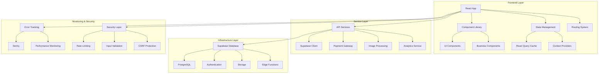

# Design Document

## Overview

This design document outlines the architecture and implementation strategy to transform the existing Naaz ecommerce application into a production-ready online store. The current application has a solid foundation with React 18, TypeScript, Supabase, and Tailwind CSS, but requires critical improvements in performance, error handling, security, and user experience.

The design follows a modular, scalable architecture that maintains the existing tech stack while adding production-grade features including comprehensive error handling, performance optimizations, security enhancements, and monitoring capabilities.

## Architecture

### Current Architecture Analysis

**Strengths:**
- Modern React 18 with TypeScript for type safety
- Supabase for backend-as-a-service with real-time capabilities
- React Query for efficient data fetching and caching
- Comprehensive admin panel with role-based access
- PWA capabilities with service worker
- Responsive design with Tailwind CSS

**Critical Issues:**
- Missing core pages (About, Checkout, Blog)
- Inconsistent error handling across components
- No performance optimizations (image optimization, code splitting)
- Security vulnerabilities (missing input sanitization, rate limiting)
- No monitoring or analytics implementation
- Incomplete testing coverage

### Target Architecture



## Components and Interfaces

### 1. Error Handling System

**Global Error Boundary**
```typescript
interface ErrorBoundaryState {
  hasError: boolean;
  error: Error | null;
  errorInfo: ErrorInfo | null;
}

interface ErrorHandlingService {
  logError(error: Error, context: string): void;
  showUserFriendlyMessage(error: Error): string;
  retryOperation(operation: () => Promise<any>): Promise<any>;
}
```

**Implementation Strategy:**
- Wrap entire app in enhanced ErrorBoundary
- Implement error logging service with Sentry integration
- Add retry mechanisms for failed API calls
- Create user-friendly error messages for common scenarios

### 2. Performance Optimization Layer

**Image Optimization Service**
```typescript
interface ImageOptimizationService {
  optimizeImage(url: string, options: ImageOptions): string;
  generateResponsiveImages(url: string): ResponsiveImageSet;
  lazyLoadImages(container: HTMLElement): void;
}

interface ImageOptions {
  width?: number;
  height?: number;
  format?: 'webp' | 'avif' | 'jpeg';
  quality?: number;
}
```

**Code Splitting Strategy:**
- Implement React.lazy() for route-based splitting
- Create vendor chunk separation in Vite config
- Add dynamic imports for heavy components
- Optimize bundle size with tree shaking

### 3. Payment Gateway Integration System

**Payment Orchestration Layer**
```typescript
interface PaymentGatewayService {
  processPayment(method: PaymentMethod, amount: number): Promise<PaymentResult>;
  validatePayment(transactionId: string): Promise<PaymentStatus>;
  refundPayment(transactionId: string, amount?: number): Promise<RefundResult>;
  getPaymentMethods(userLocation: string): PaymentMethod[];
}

interface UPayService extends PaymentGatewayService {
  generateUPIQR(amount: number, orderId: string): Promise<string>;
  validateUPIId(upiId: string): boolean;
  trackUPITransaction(transactionId: string): Promise<UPIStatus>;
}

interface PayPalService extends PaymentGatewayService {
  createPayPalOrder(amount: number, currency: string): Promise<PayPalOrder>;
  capturePayPalPayment(orderId: string): Promise<PayPalCapture>;
  handlePayPalWebhook(payload: PayPalWebhook): Promise<void>;
}
```

**Payment Security:**
- Implement PCI DSS compliance measures
- Add 3D Secure authentication for card payments
- Create fraud detection and prevention
- Implement payment tokenization

### 4. Enhanced Cart System

**Cart Persistence Layer**
```typescript
interface CartPersistenceService {
  saveCart(cart: Cart): Promise<void>;
  loadCart(): Promise<Cart>;
  syncWithServer(userId: string): Promise<void>;
  handleOfflineMode(): void;
}

interface CartState {
  items: CartItem[];
  totalItems: number;
  subtotal: number;
  isLoading: boolean;
  lastSynced: Date;
}
```

**Real-time Synchronization:**
- Implement optimistic updates for cart operations
- Add conflict resolution for concurrent cart modifications
- Create offline queue for cart operations
- Add cart recovery mechanisms

### 4. Security Enhancement Layer

**Input Validation Service**
```typescript
interface ValidationService {
  sanitizeInput(input: string): string;
  validateEmail(email: string): boolean;
  validatePassword(password: string): ValidationResult;
  sanitizeHtml(html: string): string;
}

interface RateLimitingService {
  checkRateLimit(userId: string, action: string): Promise<boolean>;
  incrementCounter(userId: string, action: string): Promise<void>;
  resetCounter(userId: string, action: string): Promise<void>;
}
```

**Security Measures:**
- Implement DOMPurify for HTML sanitization
- Add rate limiting for API endpoints
- Create CSRF token validation
- Implement secure session management

### 5. Mobile Optimization System

**Mobile-First Design Architecture**
```typescript
interface MobileOptimizationService {
  detectMobileDevice(): DeviceInfo;
  optimizeForTouch(): TouchOptimizations;
  handleGestures(element: HTMLElement): GestureHandlers;
  adaptiveLoading(networkSpeed: NetworkSpeed): LoadingStrategy;
}

interface ResponsiveDesignSystem {
  breakpoints: BreakpointConfig;
  designTokens: DesignTokens;
  componentVariants: ComponentVariants;
  mobileNavigation: NavigationPatterns;
}

interface PWAEnhancements {
  installPrompt(): Promise<void>;
  pushNotifications(message: NotificationPayload): Promise<void>;
  offlineSync(): Promise<void>;
  backgroundSync(data: SyncData): Promise<void>;
}
```

**Mobile Performance:**
- Implement mobile-specific image optimization
- Add touch gesture optimizations
- Create adaptive loading based on network conditions
- Implement mobile-first service worker strategies

### 6. Analytics and Monitoring System

**Analytics Service**
```typescript
interface AnalyticsService {
  trackEvent(event: string, properties: Record<string, any>): void;
  trackPageView(page: string): void;
  trackUserBehavior(action: UserAction): void;
  generateReport(type: ReportType): Promise<Report>;
}

interface MonitoringService {
  trackPerformance(metric: PerformanceMetric): void;
  monitorApiCalls(endpoint: string, duration: number): void;
  alertOnError(error: Error, severity: AlertSeverity): void;
}
```

## Data Models

### Enhanced Product Model
```typescript
interface Product {
  id: string;
  name: string;
  description: string;
  price: number;
  images: OptimizedImage[];
  category: Category;
  inventory: InventoryInfo;
  seo: SEOMetadata;
  analytics: ProductAnalytics;
}

interface OptimizedImage {
  original: string;
  webp: string;
  avif: string;
  thumbnails: ImageThumbnail[];
  alt: string;
}
```

### Order Management Model
```typescript
interface Order {
  id: string;
  userId: string;
  items: OrderItem[];
  status: OrderStatus;
  payment: PaymentInfo;
  shipping: ShippingInfo;
  tracking: TrackingInfo;
  timeline: OrderEvent[];
}

interface TrackingInfo {
  trackingNumber?: string;
  carrier?: string;
  estimatedDelivery?: Date;
  currentLocation?: string;
  updates: TrackingUpdate[];
}
```

### User Analytics Model
```typescript
interface UserAnalytics {
  userId: string;
  sessionId: string;
  pageViews: PageView[];
  interactions: UserInteraction[];
  conversionEvents: ConversionEvent[];
  performanceMetrics: PerformanceMetric[];
}
```

## Error Handling

### Error Classification System
```typescript
enum ErrorType {
  NETWORK_ERROR = 'network_error',
  VALIDATION_ERROR = 'validation_error',
  AUTHENTICATION_ERROR = 'auth_error',
  AUTHORIZATION_ERROR = 'authorization_error',
  SERVER_ERROR = 'server_error',
  CLIENT_ERROR = 'client_error'
}

interface ErrorHandler {
  handleError(error: Error, type: ErrorType): void;
  getRecoveryAction(error: Error): RecoveryAction;
  shouldRetry(error: Error): boolean;
}
```

### Recovery Strategies
- **Network Errors**: Implement exponential backoff retry
- **Authentication Errors**: Redirect to login with return URL
- **Validation Errors**: Show inline field-specific messages
- **Server Errors**: Show generic message with retry option
- **Client Errors**: Log for debugging, show fallback UI

### Error Logging and Monitoring
```typescript
interface ErrorLoggingService {
  logError(error: Error, context: ErrorContext): void;
  logPerformanceIssue(metric: PerformanceMetric): void;
  createErrorReport(timeRange: TimeRange): Promise<ErrorReport>;
}
```

## Testing Strategy

### Testing Pyramid Implementation

**Unit Tests (70%)**
- Component rendering and behavior
- Utility functions and services
- State management logic
- API service functions

**Integration Tests (20%)**
- Component integration with hooks
- API integration with Supabase
- Cart system end-to-end flows
- Authentication flows

**E2E Tests (10%)**
- Critical user journeys
- Checkout process
- Admin panel workflows
- Cross-browser compatibility

### Testing Tools and Configuration
```typescript
// Jest configuration for unit tests
export default {
  testEnvironment: 'jsdom',
  setupFilesAfterEnv: ['<rootDir>/src/test/setup.ts'],
  moduleNameMapping: {
    '^@/(.*)$': '<rootDir>/src/$1'
  }
};

// Playwright configuration for E2E tests
export default {
  testDir: './e2e',
  use: {
    baseURL: 'http://localhost:8080',
    screenshot: 'only-on-failure'
  }
};
```

### Performance Testing
- Lighthouse CI integration
- Bundle size monitoring
- API response time tracking
- Memory leak detection

## Implementation Phases

### Phase 1: Critical Fixes (Week 1)
1. **Complete Missing Pages**
   - Implement About page with company information
   - Build comprehensive Checkout flow
   - Create Blog system with CMS capabilities
   - Add proper 404 and error pages

2. **Error Handling Implementation**
   - Global error boundary with Sentry integration
   - Consistent error handling across all components
   - User-friendly error messages
   - Retry mechanisms for failed operations

3. **Security Enhancements**
   - Input sanitization with DOMPurify
   - Rate limiting implementation
   - CSRF protection
   - Secure session management

### Phase 2: Performance Optimization (Week 2)
1. **Image Optimization**
   - Sharp integration for image processing
   - WebP/AVIF format support
   - Lazy loading implementation
   - Responsive image generation

2. **Code Splitting and Bundling**
   - Route-based code splitting
   - Vendor chunk optimization
   - Tree shaking configuration
   - Bundle size monitoring

3. **Caching Strategy**
   - React Query optimization
   - Service worker caching
   - CDN integration
   - API response caching

### Phase 3: Feature Enhancement (Week 3)
1. **Advanced Search**
   - Fuzzy search implementation
   - Search suggestions
   - Filter optimization
   - Search analytics

2. **Order Tracking**
   - Real-time tracking updates
   - Email notifications
   - Tracking page with map integration
   - Delivery estimation

3. **Analytics Implementation**
   - User behavior tracking
   - Performance monitoring
   - Conversion tracking
   - Admin analytics dashboard

### Phase 4: Production Deployment (Week 4)
1. **Testing and QA**
   - Comprehensive test suite
   - Performance testing
   - Security testing
   - Cross-browser testing

2. **Monitoring and Alerting**
   - Error tracking setup
   - Performance monitoring
   - Uptime monitoring
   - Alert configuration

3. **Deployment Pipeline**
   - CI/CD setup
   - Environment configuration
   - Database migration strategy
   - Rollback procedures

## Performance Targets

### Core Web Vitals
- **Largest Contentful Paint (LCP)**: < 2.5 seconds
- **First Input Delay (FID)**: < 100 milliseconds
- **Cumulative Layout Shift (CLS)**: < 0.1

### Application Metrics
- **Time to Interactive**: < 3 seconds
- **Bundle Size**: < 500KB initial load
- **API Response Time**: < 200ms average
- **Error Rate**: < 1% of all requests

### Business Metrics
- **Conversion Rate**: > 2%
- **Cart Abandonment**: < 30%
- **Page Load Success Rate**: > 99%
- **User Satisfaction**: > 4.5/5

## Security Considerations

### Data Protection
- Implement proper data encryption at rest and in transit
- Use secure HTTP headers (HSTS, CSP, X-Frame-Options)
- Regular security audits and vulnerability scanning
- Compliance with GDPR and data protection regulations

### Authentication and Authorization
- Multi-factor authentication support
- Session timeout and management
- Role-based access control refinement
- API key rotation and management

### Input Validation and Sanitization
- Server-side validation for all inputs
- SQL injection prevention
- XSS protection with Content Security Policy
- File upload security measures

This design provides a comprehensive roadmap for transforming the existing ecommerce application into a production-ready platform while maintaining the current architecture's strengths and addressing all identified weaknesses.